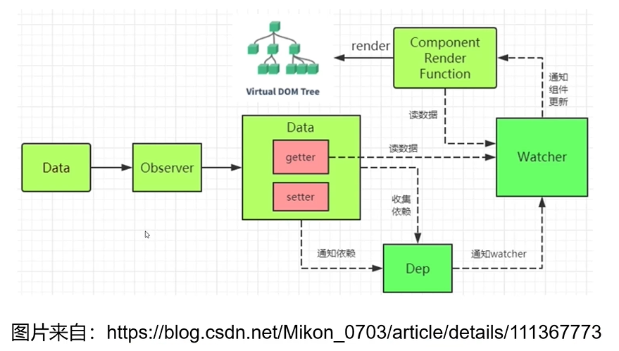

### 	Vue2数据更新原理

### MVVM模式

### 侵入式和非侵入式

### 尤大大找到了"上帝的钥匙"

## Object.defineProperty()

- 数据劫持/数据代理

  利用JavaScript引擎赋予的功能，检测对象属性变化仅有"上帝的钥匙"不够，还需要设计一套精密的系统

- Object.defineProperty()方法会直接在一个对象上定义一个新属性，或者修改一个对象的现有属性，并返回此对象。

- 可以设置一些额外隐藏的属性

  writable、enumerable、

### get

​	属性的 getter 函数，如果没有 getter，则为 `undefined`。当访问该属性时，会调用此函数。执行时不传入任何参数，但是会传入 `this` 对象（由于继承关系，这里的`this`并不一定是定义该属性的对象）。该函数的返回值会被用作属性的值。	**默认为 [`undefined`](https://developer.mozilla.org/zh-CN/docs/Web/JavaScript/Reference/Global_Objects/undefined)**。

### set

​	属性的 setter 函数，如果没有 setter，则为 `undefined`。当属性值被修改时，会调用此函数。该方法接受一个参数（也就是被赋予的新值），会传入赋值时的 `this` 对象。	**默认为 [`undefined`](https://developer.mozilla.org/zh-CN/docs/Web/JavaScript/Reference/Global_Objects/undefined)**。

### getter/setter需要变量周转才能工作

### defineReactive函数（利用闭包）

## Observer

​	将一个正常的object转换为每个层级的属性都是响应式（可以被侦测的）的object

## 对数组的处理（7种方法改写）

### Array.prototype

#### push、pop、shift、unshift、splice、sort、reverse

**以Array.prototype为原型，创建arrayMethods对象，利用Object.setPrototypeOf,强制让数组指向arrayMethods**

### Object.setPrototypeOf(o, arrayMethods) == o.\_\_proto\_\_ = arrayMethods

## 依赖收集

### 什么是依赖？

- 需要用到数据的地方称为依赖
- Vue1.x，细粒度依赖，用到数据的DOM都是依赖；
- Vue2.x，中等粒度依赖，用到数据的组件是依赖；
- **在getter中收集依赖，在setter中触发依赖**

### Dep类和Watcher类

- 把依赖收集的代码封装成一个Dep类，它专门用来管理依赖，每个Observer的实例成员中都有一个Dep的实例。
- Watcher是一个中介，数据发生变化时通过Watcher中转，通知组件

- **依赖就是watcher。只有watcher触发的getter才会收集依赖，哪个watcher触发了getter，就把哪个watcher收集到Dep中。**
- **Dep使用发布订阅模式，当数据发生变化时，会循环依赖列表，把所有的watcher都通知一遍。**
- **代码实现的巧妙之处: watcher把自己设置到全局的一个指定位置，然后读取数据，因为读取了数据，所以会触发这个数据的getter。在getter中就能得到当前正在读取数据的watcher，并把这个watcher收集到Dep中。**

### 一个高阶函数

