### snabbdom简介

- **snabbdom是著名的虚拟DOM库，是diff算法的鼻祖，Vue源码借鉴了snabbdom**

### snabbdom的h函数

- h函数用来产生虚拟节点（vnode）

- 比如

  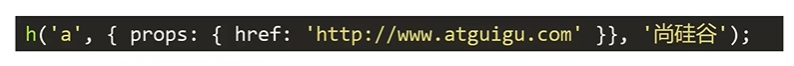

  得到

  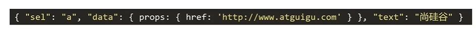

  真正的dom节点：

  

  

- **一个虚拟节点的属性**

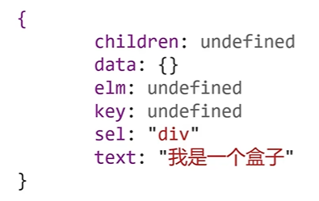

#### h函数可以嵌套

- 比如这样嵌套使用

  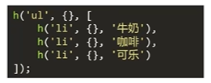

- 将得到

  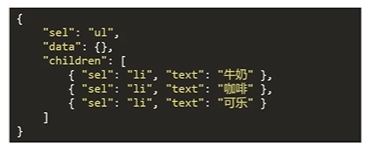

- h函数的活用

  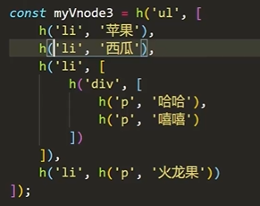

  

### diff算法原理

- 最小量更新。**key是节点的唯一标识，告诉diff算法，在更改前后它们是同一个DOM节点**
- **只有是同一个虚拟节点，才进行精细化比较**，否则就是暴力删除旧的、插入新的。
- 延伸问题：如何定义是同一个虚拟节点？答：选择器相同且key相同
- **只进行同层比较，不会进行跨层比较。**即使是同一片虚拟节点，但是跨层了，精细化不会diff。而是暴力删除旧的、插入新的。

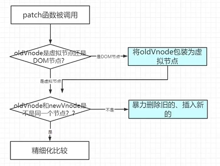

- 旧节点的key要和老节点的key相同，旧节点的选择器要和新节点的选择器相同

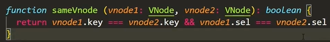

#### patch函数

##### -不是同一节点时候、暴力插入新的，删除旧的

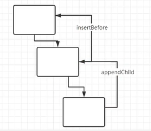

- 传入的vode有children，同时还要递归子节点

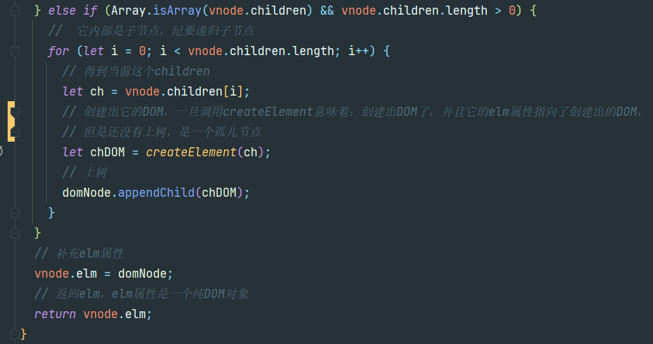

- 上树操作，利用parentNode的insertBefore去append到dom

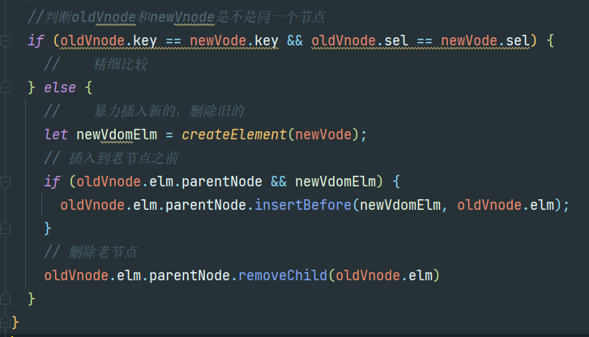

##### -是同一节点、精细化比较（重点）

#### diff算法的子节点更新策略

**四种命中查找：**

1. 新前与旧前
2. 新后与旧后
3. 新后与旧前（此种发生了，涉及移动节点，新前节点移动到旧后之前）
4. 新前与就后（此种发生了，涉及移动节点，新前节点移动到旧前之前）

**命中一种就不再做命中判断**

- **如果是旧节点先循环完毕，说明新节点中有要插入的节点。**

- **如果是新节点先循环完毕，如果老节点中还有剩余（旧前和旧后指针中间的节点），说明他们是要被删除的节点。**

- 当新后与旧前命中时，移动节点。移动**旧前**指向这个节点到老节点的**旧后的后面。**

- 当新前与旧后命中时，移动节点。移动**新前**指向这个节点到老节点的**旧前的前面。**

  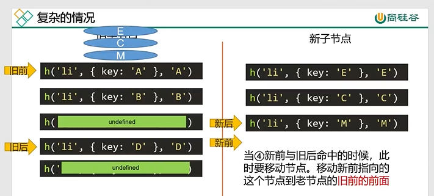

**如果都没命中就用循环找**

### 手写diff算法